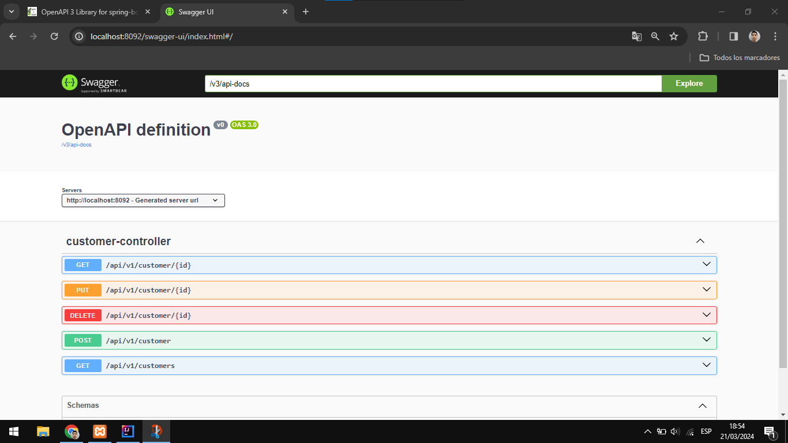
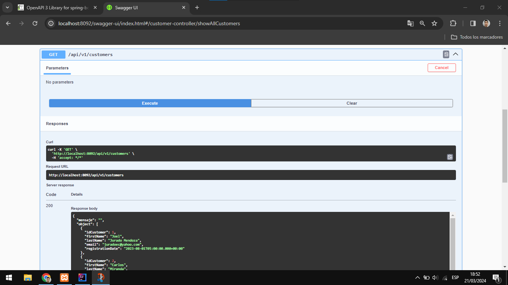
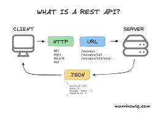

# Gestión de clientes con API REST y Spring Boot

Se desarrolló un proyecto para gestionar clientes siguiendo buenas prácticas con API REST utilizando Spring Boot.

## Funcinalidades:
- Eliminar Clientes
- Agregar Clientes
- Actualizar Clientes
- Listador a todos los clientes
- Listador a un cliente en especifico.

## Proyecto

Se documentan las API de forma rápida y sencilla, asignando correctamente las URL en base a los métodos HTTP:

Además, permite ejecutar, como muestra el listado de todos los clientes.

## Instalación
- Necesitas descargar IntelliJ IDEA Community Edition.
- Se requiere la versión Java JDK 17 LTS.

## Api:
- Proporciona acceso a las funcionalidades de una aplicación para ser utilizado por otras aplicaciones o servicios en formato JSON.

## Rest:
- Es un estilo arquitectónico diseñado para establecer cómo se debe estructurar la URL y cómo se deben utilizar los diferentes métodos HTTP (GET, POST, PUT, DELETE).

## Api rest:
- Es el conjunto de reglas de buenas prácticas que se sigue para que otras aplicaciones puedan consumirlo de manera simple.

    

## Creación del proyecto 
- Instalar el plugin Lombok en IntelliJ IDEA. 
- Utilizar https://start.spring.io/ para crear un proyecto.

## Depedencias:
- Spring web
- Lombok
- Mysql Driver
- Spring Data JPA
- Spring Boot Dev Tools
- openapi para documentar https://springdoc.org/#getting-started

## Ejecutar proyecto:
- Domcumentación: http://localhost:8092/swagger-ui-custom.html
- En postman: http://localhost:8092/api/v1/customers
- En IntelliJ IDEA, ejecutar la aplicación.